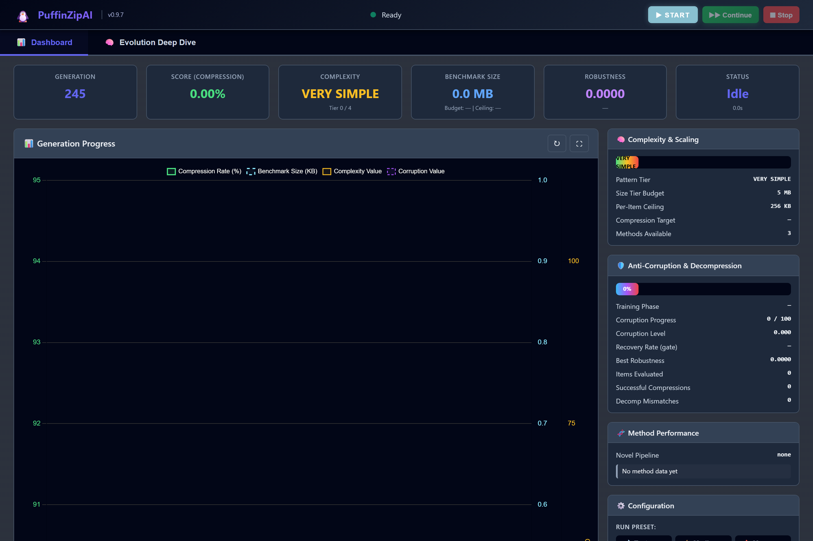
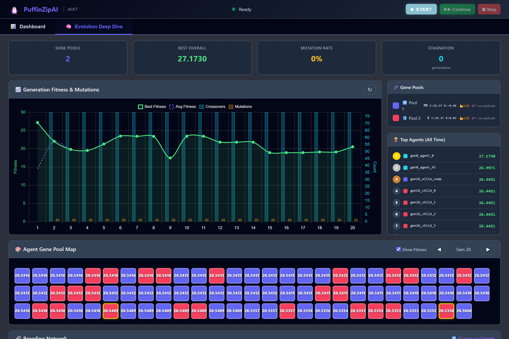

# PuffinZipAI

**AI-driven compression research platform** — populations of Q-learning and Dueling-DQN agents explore compression strategies, breed across dual gene pools, and are scored against real baselines (gzip, bz2, lzma, zlib, zstd).

> **Working Prototype · v0.9.10** · [PolyForm Noncommercial 1.0.0](LICENSE)
>
> Experimental research project. Discovered strategies do **not** currently beat established compressors; the platform is a testbed for whether RL + evolutionary search can learn useful compression behaviours.

<p align="center">
  
</p>

<p align="center"><sub>WebUI dashboard — live training metrics, complexity scaling, Test / Medium / Max presets</sub></p>

---

## Why this exists

Classical compressors are hand-designed and extremely strong. PuffinZipAI asks a different question: *can a population of agents invent and refine invertible pipelines through evolution and reinforcement learning?*

The answer so far is “interesting research, not competitive compression.” Gold-standard wins (beating every baseline on every item) have **not** been achieved. Progress is measured generation-over-generation against those baselines, not claimed as production-ready algorithms.

## Features at a glance

| Area | What you get |
|------|----------------|
| **Agents** | Tabular Q-learning, CuPy GPU Q-tables, Dueling DQN + NoisyNet + PER (optional PyTorch) |
| **Dual gene pools** | 50/50 **compression** vs **anti-corruption** agents; dual fitness; specialised breeding |
| **Recipe evolution** | Incremental novel-method recipes (not one-shot random pipelines); strength, maturity, vault, registry/graveyard, rare resurrection |
| **Evolution** | Selection, crossover, mutation, elitism, “grandpapi” heritage, diversity-collapse boost |
| **Primitives** | RLE (simple/advanced), BWT, MTF, Delta, BPE, discovery transforms (XOR / permute / block-shuffle, …) |
| **Heterogeneous eval** | Pipelined population scoring: batched GPU inference + CPU/GPU RLE split; optional batched CUDA RLE (UTF-32 safe) |
| **Benchmarking** | Head-to-head vs gzip / bz2 / lzma / zlib / zstd; continuous complexity (0–100%); gold-standard checkpoints |
| **WebUI** | Dashboard + **Evolution Deep Dive** (gene grid, lineage, breeding network, recipe stats) |
| **Deploy** | `start.bat` / `start.sh` hardware auto-detect, run presets, multi-GPU scaling, Cloudflare Tunnel, RunPod-aware ports |

<p align="center">
  
</p>

<p align="center"><sub>Evolution Deep Dive — gene pools, top agents, lineage, breeding network, pool×pool matrix</sub></p>

## Quick start

### 1. Clone & install

```bash
git clone https://github.com/Stelliro/PuffinZipAI.git
cd PuffinZipAI
python -m venv .venv

# Windows
.venv\Scripts\activate
# Linux / macOS
source .venv/bin/activate

pip install -r requirements.txt
```

### 2. Launch the Web UI

```bash
# Windows
start.bat

# Linux / macOS
bash start.sh
```

Then open **http://localhost:5001** (port may differ on cloud pods).

The launcher:

- Detects CPU / RAM / GPU (and can auto-install CuPy when CUDA is present)
- Creates `webui_credentials.json` with login credentials on first run
- Honours optional `.env` for host, port, auth, and tunnel settings
- Surfaces **Test / Medium / Max** run presets in the dashboard

### 3. Other entry points

```bash
python run_gui.py    # Tkinter desktop GUI
python main_cli.py   # CLI
```

### Optional dependencies

Core install is **CPU-only**. For extras:

```bash
pip install cupy-cuda12x   # GPU (CUDA 12.x); launchers may auto-install when a GPU is detected
pip install torch          # Dueling DQN agents
pip install zstandard      # zstd baseline in benchmarks
```

### Useful environment variables

| Variable | Purpose |
|----------|---------|
| `PUFFIN_HOST` / `PUFFIN_PORT` | Bind address and port |
| `PUFFIN_WORKERS` | CPU worker count (default: auto) |
| `PUFFIN_GPUS` | Comma-separated GPU IDs (Linux/macOS) |
| `PUFFIN_USERNAME` / `PUFFIN_PASSWORD` | Primary WebUI login |
| `PUFFIN_ADMIN_USERNAME` / `PUFFIN_ADMIN_PASSWORD` | Admin / remote login |
| `PUFFIN_CUSTOM_URL` | Banner URL (e.g. public tunnel) |
| `GITHUB_TOKEN` | Higher rate limits for real-world file fetch |

Put these in a local `.env` (git-ignored) or export them in the shell.

### Remote access

To publish the WebUI without opening ports (laptop, RunPod, etc.):

**[docs/CLOUDFLARE_TUNNEL_GUIDE.md](docs/CLOUDFLARE_TUNNEL_GUIDE.md)**

Launchers can install `cloudflared` and attach a tunnel token when configured.

## How it works

```
┌─────────────┐    evaluate     ┌──────────────────┐    breed     ┌─────────────┐
│  Population │ ──────────────► │ Fitness + gold   │ ───────────► │ Next gen    │
│  (dual pool)│   CPU ∥ GPU     │ standard baselines│  recipes +  │ + heritage  │
└─────────────┘                 └──────────────────┘  diversity   └─────────────┘
       ▲                                                              │
       └──────────────── continuous complexity scaling ───────────────┘
```

1. **Initialise** — Balanced compression / anti-corruption population (tabular or DQN). Recipe vault can seed proven pipelines from prior runs.
2. **Evaluate** — Dynamic benchmarks; fitness mixes compression, round-trip / robustness, speed, and diversity. GPU hosts use a **pipelined** path (batched inference + split RLE).
3. **Benchmark** — Best agent vs gzip / bz2 / lzma / zlib / zstd every generation. Gold-standard checkpoint only if *all* baselines lose on *every* item (not yet achieved).
4. **Evolve recipes** — Small mutations, strength up on real gains, decay when stagnant, archive to graveyard, rare resurrection when breeding.
5. **Breed** — Selection / crossover / mutation with per-type elitism and heritage. Diversity-collapse detection can raise mutation when the population converges too hard.
6. **Scale difficulty** — Continuous complexity (0–100%) with dwell/hysteresis so the curriculum does not thrash.
7. **Loop** — Until generation limit, infinite-mode stop, or user halt. WebUI **Continue** resumes without discarding the population.

## Project layout

```
PuffinZipAI/
├── start.bat / start.sh         # Universal launchers
├── webui_server.py              # Flask dashboard + deep-dive API
├── main_cli.py / run_gui.py     # CLI & Tkinter entry points
├── puffinzip_ai/                # Core package
│   ├── evolution_core/          # Optimiser, breeding, agents
│   ├── gpu_core/                # CuPy / CUDA agents & RLE
│   ├── nn_core/                 # Dueling DQN
│   ├── novel_compression_generator.py  # Pipelines + recipes
│   └── utils/                   # Pipelined evaluator, fetcher, …
├── webui_static/ · webui_templates/
├── data/                        # Runtime vault / registry / caches
├── docs/                        # Guides + screenshot assets
└── CODEBASE_INDEX.md            # Full architecture reference
```

## Documentation

| Document | Description |
|----------|-------------|
| [CODEBASE_INDEX.md](CODEBASE_INDEX.md) | Architecture & API map |
| [docs/WEBUI_GUIDE.md](docs/WEBUI_GUIDE.md) | Web UI usage |
| [docs/CLOUDFLARE_TUNNEL_GUIDE.md](docs/CLOUDFLARE_TUNNEL_GUIDE.md) | Public HTTPS tunnel |
| [docs/HYBRID_COMPRESSION_GUIDE.md](docs/HYBRID_COMPRESSION_GUIDE.md) | Hybrid engine notes |
| [docs/changelog.md](docs/changelog.md) | Development history |

Screenshots in `docs/assets/` are captures of the live WebUI. To re-take them (server must be running on port 5001):

```bash
# terminal 1
python webui_server.py

# terminal 2
python docs/assets/_render_shots.py
```

## License

Licensed under the [PolyForm Noncommercial License 1.0.0](LICENSE).  
Use, modify, and share freely for **non-commercial** purposes.  
Commercial use requires a separate written agreement from the licensor.
